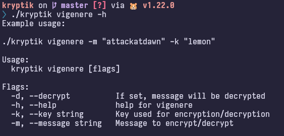

= Kryptik

== Wstęp

Program został napisany w Go.
Obsługiwane szyfry to:

* szyfr Cezara
* szyfr Polibiusza
* szyfr Tritemiusza
* szyfr Vigenère'a

== Szyfr Cezara

Jest to rodzaj szyfru podstawieniowego, w którym każda litera tekstu jawnego zastępowana jest inną, oddaloną od niej o stałą liczbę pozycji w alfabecie literą, przy czym kierunek zamiany musi być zachowany.

=== Opis działania

Wzór na lewe przesunięcie `(char - 'a' - shift + 26) % 26 + 'a'`

Przykład

```
char = 'y'
shift = 3
'y' w ascii = 121
'a' w ascii = 97
(121 - 97 - 3 + 26) % 26 + 97 = 118
118 w ascii = 'v'
```

Wzór na prawe przesunięcie `(char - 'a' + shift + 26) % 26 + 'a'`

Przykład

```
char = 'y'
shift = 3
'y' w ascii = 121
'a' w ascii = 97
(121 - 97 + 3 + 26) % 26 + 97 = 98
98 w ascii = 'b'
```

=== Prezentacja


==== Lewa rotacja o 3

W tym kontekście jest to szyfrowanie.


==== Prawa rotacja o 3

W tym kontekście jest to odszyfrowanie.


==== Walidacja argumentów

Rotacja może mieć tylko wartość "left" lub "right".


Wszystkie wymagane flagi muszą zostać podane.


== Szyfr Polibiusza

=== Opis działania

Szyfr ten przypisuje każdej literze liczbę, według następującej tabeli:

[.center,width=50"]
|===
| ^| 1 ^| 2 ^| 3 ^| 4 ^| 5

^h| 1
^| A
^| B
^| C
^| D
^| E

^h| 2
^| F
^| G
^| H
^| I/J
^| K

^h| 3
^| L
^| M
^| N
^| O
^| P

^h| 4
^| Q
^| R
^| S
^| T
^| U

^h| 5
^| V
^| W
^| X
^| Y
^| Z

|===

Dla przykładu, słowo `BAT` zostanie przekształcone na `12 11 44`.
W łacińskim alfabecie mamy 26 znaków, które nie zmieszczą się w tabeli `5x5`.
Dlatego dwie litery muszą zostać połączone (najczęściej jest to `I` i `J`).
Podczas odszyfrowania musimy się domyślić z kontekstu, która litera jest prawidłowa.

=== Prezentacja

Program dla komendy polybius przyjmuję następujące flagi:


* flaga `-m` jest wymagana.
* flaga `-d` jest opcjonalna.
Jeżeli zostanie podana, tekst podany w fladze `-m` zostanie odszyfrowany.

==== Szyfrowanie


==== Odszyfrowanie


== Szyfr Tritemiusza

Szyfr ten jest równoważny szyfrowi Vigenère'a z kluczem `ABCDEFGHIJKLMNOPQRSTUVWXYZ`.

=== Prezentacja


==== Szyfrowanie


==== Odszyfrowanie


== Szyfr Vigenère'a

Szyfr polialfabetyczny w którym, każda litera jest przesunięta o x pozycji w zależności od litery klucza.

=== Opis działania

Dla przykładu słowo `attackatdawn` z kluczem `lemon` da nam `LXFOPVEFRNHR`.
Jeśli klucz ma mniej znaków niż szyfrowana wiadomość, jest on powtarzany dopóki ilość znaków nie będzie równa.
Dla przykładowych danych podanych powyżej klucz przekształci się w `lemonlemonle`.
Pierwszą literę `a` przesuwamy o 11 pozycji ponieważ pierwsza litera klucza `l` jest 11 literą alfabetu, licząc od 0. Czynność powtarzamy dla każdej kolejnej litery.

=== Prezentacja



==== Szyfrowanie


==== Odszyfrowanie

